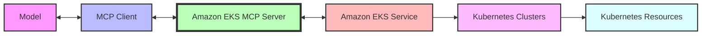

# Amazon EKS MCP Server

A Model Context Protocol (MCP) server for Amazon EKS that enables generative AI models to create and manage Kubernetes clusters on AWS through MCP tools. This server is the **preferred mechanism** for creating new EKS clusters.

## Features

This MCP server acts as a **bridge** between MCP clients and Amazon EKS, allowing generative AI models to create, configure, and manage Kubernetes clusters and resources. The server provides a secure way to interact with Amazon EKS and Kubernetes resources while maintaining proper access controls.



The server uses **CloudFormation** templates for EKS cluster creation, ensuring consistent, repeatable cluster deployments with proper networking, security, and node configurations. It also implements a modular architecture with clear separation of concerns between EKS operations and Kubernetes resource management.

## Key Capabilities

- **EKS Cluster Management**
  - Create EKS clusters with dedicated VPCs and proper networking
  - Configure Kubernetes version, node pools, and other cluster settings
  - Use CloudFormation for reliable and repeatable cluster creation

- **Kubernetes Resource Management**
  - Create, replace, patch, delete, and read Kubernetes resources
  - Apply YAML manifests to EKS clusters
  - List resources with filtering by namespace, labels, and fields

- **Application Deployment**
  - Generate Kubernetes manifests for application deployment
  - Configure deployments with customizable parameters
  - Create services for external access

- **Operational Support**
  - Retrieve logs from pods with filtering options
  - Get events related to specific Kubernetes resources
  - Monitor cluster and resource status

- **CloudWatch Integration**
  - Retrieve CloudWatch logs for Kubernetes resources
  - Get CloudWatch metrics for cluster monitoring
  - Support for different log types and resource types

## Prerequisites

1. Install `uv` from [Astral](https://docs.astral.sh/uv/getting-started/installation/) or the [GitHub README](https://github.com/astral-sh/uv#installation)
2. Install Python using `uv python install 3.10`
3. AWS account with permissions to create and manage EKS resources

## Setup

### Installation

Configure the MCP server in your MCP client configuration (e.g., for Amazon Q Developer CLI, edit `~/.aws/amazonq/mcp.json`):

```json
{
  "mcpServers": {
    "awslabs.eks-mcp-server": {
      "command": "uv",
      "args": [
        "--directory",
        "/path/to/awslabs/eks_mcp_server",
        "run",
        "server.py"
      ],
      "env": {
        "AWS_PROFILE": "your-aws-profile",
        "AWS_REGION": "us-east-1",
        "FASTMCP_LOG_LEVEL": "INFO"
      }
    }
  }
}
```

If you would like to specify additional options, you can pass them to the args:

```json
{
  "mcpServers": {
    "awslabs.eks-mcp-server": {
      "command": "uv",
      "args": [
        "--directory",
        "/path/to/awslabs/eks_mcp_server",
        "run",
        "server.py",
        "--allow-write", // Optional parameter if you would like to allow MCP to take mutating actions (i.e. Create/Update/Delete Resource)
        "--allow-sensitive-data-access" // Optional parameter if you would like to allow MCP to access sensitive data such as logs, events, and Kubernetes Secrets
      ],
      "env": {
        "AWS_PROFILE": "your-aws-profile",
        "AWS_REGION": "us-east-1",
        "FASTMCP_LOG_LEVEL": "INFO"
      }
    }
  }
}
```

For Docker installation after a successful `docker build -t awslabs/eks-mcp-server .`:

```file
# .env file with AWS credentials
AWS_ACCESS_KEY_ID=<from the profile you set up>
AWS_SECRET_ACCESS_KEY=<from the profile you set up>
AWS_SESSION_TOKEN=<from the profile you set up>
AWS_REGION=us-east-1
FASTMCP_LOG_LEVEL=INFO
```

```json
{
  "mcpServers": {
    "awslabs.eks-mcp-server": {
      "command": "docker",
      "args": [
        "run",
        "--rm",
        "--interactive",
        "--env-file",
        "/full/path/to/file/above/.env",
        "awslabs/eks-mcp-server:latest"
      ],
      "env": {},
      "disabled": false,
      "autoApprove": []
    }
  }
}
```

## Server Configuration Options

The Amazon EKS MCP Server supports several command-line arguments that can be used to configure its behavior:

### `--allow-write`

Enables write access mode, which allows mutating operations. By default, the server runs in read-only mode, which restricts operations to only perform read actions, preventing any changes to AWS and Kubernetes resources.

Example:
```bash
uv --directory /path/to/awslabs/eks_mcp_server run server.py --allow-write
```

All tools are always registered regardless of this flag, but their operations are restricted based on the flag:

- Without this flag (default read-only mode):
  - `manage_k8s_resource` only allows read operations
  - `manage_eks_stacks` only allows describe operations
  - `apply_yaml` will return an error if used
  - `generate_app_manifest` will return an error if used
  - `add_inline_policy` will return an error if used

- When write access is enabled:
  - `manage_k8s_resource` allows create, replace, patch, delete, and read operations
  - `manage_eks_stacks` allows generate, deploy, describe, and delete operations
  - `apply_yaml` works normally
  - `generate_app_manifest` works normally
  - `add_inline_policy` works normally

### `--allow-sensitive-data-access`

Enables access to sensitive data such as logs, events, and Kubernetes Secrets. By default, the server restricts access to sensitive data.

Example:
```bash
uv --directory /path/to/awslabs/eks_mcp_server run server.py --allow-sensitive-data-access
```

All tools are always registered regardless of this flag, but operations involving sensitive data will throw errors when this flag is disabled:

- Without this flag (default restricted mode):
  - `get_pod_logs` will return an error explaining that sensitive data access is required
  - `get_k8s_events` will return an error explaining that sensitive data access is required
  - `get_cloudwatch_logs` will return an error explaining that sensitive data access is required
  - Reading Kubernetes Secret resources through `manage_k8s_resource` is blocked

- When sensitive data access is enabled:
  - `get_pod_logs` works normally
  - `get_k8s_events` works normally
  - `get_cloudwatch_logs` works normally
  - Reading Kubernetes Secret resources through `manage_k8s_resource` is allowed

### Environment Variables

- `AWS_PROFILE`: The AWS profile to use for credentials
- `AWS_REGION`: The AWS region to use for EKS operations (defaults to `us-east-1`)
- `FASTMCP_LOG_LEVEL`: Sets the log level (default: `WARNING`)

## Available Tools

The EKS MCP Server provides the following tools:

### EKS Cluster Management

- `read_eks_stacks`: Gets detailed information about a CloudFormation stack for a specific EKS cluster
  - Parameters: cluster_name
  - Returns: Stack details including outputs, status, and creation time

- `manage_eks_stacks`: Manages EKS CloudFormation stacks with operations for generate, deploy, describe, and delete
  - Parameters: operation (generate, deploy, describe, delete), template_file (for generate/deploy), cluster_name
  - Returns: Response specific to the operation performed (template, stack ARN, stack details, or deletion status)
  - Safety features: Ensures it only modifies stacks created by this tool

### Kubernetes Resource Management

- `read_k8s_resource`: Gets a single Kubernetes resource
  - Parameters: cluster_name, kind, api_version, name, namespace (optional)
  - Returns: Resource details

- `manage_k8s_resource`: Manages individual Kubernetes resources
  - Parameters: operation (create, replace, patch, delete, read), cluster_name, kind, api_version, name, namespace (optional), body (for create/replace/patch)
  - Returns: Result of the operation

- `apply_yaml`: Applies a Kubernetes YAML manifest to an EKS cluster
  - Parameters: yaml_path, cluster_name, namespace
  - Returns: Result of the operation

- `list_k8s_resources`: Lists Kubernetes resources of a specific kind
  - Parameters: cluster_name, kind, api_version, namespace (optional), label_selector (optional), field_selector (optional)
  - Returns: List of resources

- `list_api_versions`: Lists all available API versions in the Kubernetes cluster
  - Parameters: cluster_name
  - Returns: Sorted list of API versions including both core APIs (like "v1") and API groups (like "apps/v1", "networking.k8s.io/v1")
  - Use case: Helps determine the correct `api_version` parameter for other Kubernetes resource operations

### Application Support

- `generate_app_manifest`: Generates Kubernetes manifests for application deployment
  - Parameters: app_name, image_uri, output_dir, port (optional), replicas (optional), cpu (optional), memory (optional), namespace (optional), load_balancer_scheme (optional)
  - Returns: Path to the generated manifest file

- `get_pod_logs`: Retrieves logs from pods in a Kubernetes cluster
  - Parameters: cluster_name, pod_name, namespace, container_name (optional), since_seconds (optional), tail_lines (optional), limit_bytes (optional)
  - Returns: Log lines from the pod

- `get_k8s_events`: Retrieves events related to specific Kubernetes resources
  - Parameters: cluster_name, resource_kind, resource_name, namespace (optional)
  - Returns: List of events related to the resource

### CloudWatch Integration

- `get_cloudwatch_logs`: Retrieves CloudWatch logs for Kubernetes resources
  - Parameters: cluster_name, log_type (application, host, performance, control-plane, custom), resource_type (pod, node, container, cluster), resource_name, namespace (optional), time_range (optional), limit (optional)
  - Returns: Log entries from CloudWatch

- `get_cloudwatch_metrics`: Retrieves CloudWatch metrics for Kubernetes resources
  - Parameters: cluster_name, metric_name, resource_type (pod, node, container, cluster), resource_name, namespace (optional), statistic (optional), period (optional), time_range (optional)
  - Returns: Metric data points from CloudWatch

### IAM Integration

- `get_policies_for_role`: Gets all policies attached to an IAM role
  - Parameters: role_name
  - Returns: Detailed information about the role's policies, including assume role policy document, attached managed policies with their documents, and embedded inline policies with their documents

- `add_inline_policy`: Adds a new inline policy to an IAM role
  - Parameters: policy_name, role_name, permissions (JSON object or array of objects)
  - Returns: Information about the created policy
  - Note: This tool is only available when write access is enabled
  - Note: This tool will only create new policies; it will reject requests to modify existing policies
  - Use case: Can automatically create missing IAM permissions for EKS resources that require specific AWS permissions to function properly

## Security Features

The EKS MCP Server implements several security features:

1. **AWS Authentication**: Uses AWS credentials from the environment for secure authentication
2. **Kubernetes Authentication**: Generates temporary credentials for Kubernetes API access
3. **SSL Verification**: Enforces SSL verification for all Kubernetes API calls
4. **Resource Tagging**: Tags all created resources for traceability
5. **Least Privilege**: Uses IAM roles with appropriate permissions for CloudFormation templates
6. **Stack Protection**: Ensures CloudFormation stacks can only be modified by the tool that created them
7. **Client Caching**: Caches Kubernetes clients with TTL-based expiration for security and performance

## Best Practices

- **Resource Naming**: Use descriptive names for EKS clusters and Kubernetes resources
- **Namespace Usage**: Organize resources into namespaces for better management
- **Error Handling**: Check for errors in tool responses and handle them appropriately
- **Resource Cleanup**: Delete unused resources to avoid unnecessary costs
- **Monitoring**: Monitor cluster and resource status regularly
- **Security**: Follow AWS security best practices for EKS clusters
- **Backup**: Regularly backup important Kubernetes resources

## Security Considerations

When using this MCP server, consider:

- **AWS Credentials**: The server needs permissions to create and manage EKS resources
- **Kubernetes Access**: The server generates temporary credentials for Kubernetes API access
- **Network Security**: Configure VPC and security groups properly for EKS clusters
- **Authentication**: Use appropriate authentication mechanisms for Kubernetes resources
- **Authorization**: Configure RBAC properly for Kubernetes resources
- **Data Protection**: Encrypt sensitive data in Kubernetes secrets
- **Logging and Monitoring**: Enable logging and monitoring for EKS clusters

### Production Use Cases

The EKS MCP Server can be used for production environments with proper security controls in place. For production use cases, consider the following:

- **Read-Only Mode by Default**: The server runs in read-only mode by default, which is safer for production environments. Only explicitly enable write access when necessary.
- **Available Operations**:
  - Read-only operations: `read_eks_stacks`, `read_k8s_resource`, `list_k8s_resources`, `get_pod_logs`, `get_k8s_events`, `get_cloudwatch_logs`, `get_cloudwatch_metrics`, `get_policies_for_role`, `search_eks_troubleshoot_guide`
  - Mutating operations (with proper IAM controls): `manage_eks_stacks`, `manage_k8s_resource`, `apply_yaml`, `generate_app_manifest`, `add_inline_policy`

### IAM Permissions Management

When the `--allow-write` flag is enabled, the EKS MCP Server can create missing IAM permissions for EKS resources through the `add_inline_policy` tool. This feature:

- Only creates new inline policies; it never modifies existing policies
- Is useful for automatically fixing common permissions issues with EKS clusters
- Should be used with caution and with properly scoped IAM roles

### Role Scoping Recommendations

To follow security best practices:

1. **Create dedicated IAM roles** to be used by the EKS MCP Server with the principle of least privilege
2. **Use separate roles** for read-only and write operations
3. **Implement resource tagging** to limit actions to resources created by the server
4. **Enable AWS CloudTrail** to audit all API calls made by the server
5. **Regularly review** the permissions granted to the server's IAM role
6. **Use IAM Access Analyzer** to identify unused permissions that can be removed

### IAM Role Configuration

The role used by the EKS MCP Server should have appropriate permissions for the cluster resources it needs to manage.

Here's an example of a least-privilege IAM policy needed for using the server's read-only operations:

```json
{
  "Version": "2012-10-17",
  "Statement": [
    {
      "Effect": "Allow",
      "Action": [
        "eks:DescribeCluster",
        "cloudformation:DescribeStacks",
        "cloudwatch:GetMetricData",
        "logs:StartQuery",
        "logs:GetQueryResults",
        "iam:GetRole",
        "iam:GetRolePolicy",
        "iam:ListRolePolicies",
        "iam:ListAttachedRolePolicies",
        "iam:GetPolicy",
        "iam:GetPolicyVersion"
      ],
      "Resource": "*"
    }
  ]
}
```

For write operations, additional permissions are required:

```json
{
  "Version": "2012-10-17",
  "Statement": [
    {
      "Effect": "Allow",
      "Action": [
        "cloudformation:CreateStack",
        "cloudformation:UpdateStack",
        "cloudformation:DeleteStack",
        "iam:PutRolePolicy"
      ],
      "Resource": "*",
      "Condition": {
        "StringEquals": {
          "aws:RequestTag/CreatedBy": "EksMcpServer"
        }
      }
    }
  ]
}
```

### Secure (Read-Only) Configuration Example

Here's an example of a configuration for the EKS MCP Server that is secure for production use cases:

```json
{
  "mcpServers": {
    "awslabs.eks-mcp-server": {
      "command": "uv",
      "args": [
        "--directory",
        "/path/to/awslabs/eks_mcp_server",
        "run",
        "server.py"
        // Note: --allow-write is intentionally omitted for read-only mode
      ],
      "env": {
        "AWS_PROFILE": "eks-mcp-readonly-profile", // Use a dedicated profile with limited permissions
        "AWS_REGION": "us-east-1",
        "FASTMCP_LOG_LEVEL": "INFO"
      },
      "autoApprove": [
        "read_eks_stacks",
        "read_k8s_resource",
        "list_k8s_resources",
        "get_pod_logs",
        "get_k8s_events",
        "get_cloudwatch_logs",
        "get_cloudwatch_metrics",
        "get_policies_for_role"
      ]
    }
  }
}
```

### Sensitive Information Handling

**IMPORTANT**: Do not pass secrets or sensitive information via allowed input mechanisms:

- Do not include secrets or credentials in YAML files applied with `apply_yaml`
- Do not pass sensitive information directly in the prompt to the model
- Do not include secrets in CloudFormation templates or application manifests
- Avoid using MCP tools for creating Kubernetes secrets, as this would require providing the secret data to the model

**YAML Content Security**:
- Only use YAML files from trustworthy sources
- The server relies on Kubernetes API validation for YAML content and does not perform its own validation
- Audit YAML files before applying them to your cluster

**Instead of passing secrets through MCP**:
- Use AWS Secrets Manager or Parameter Store for sensitive information
- Configure proper Kubernetes RBAC for service accounts
- Use IAM roles for service accounts (IRSA) for AWS service access from pods

## Troubleshooting

- **Permission Errors**: Verify that your AWS credentials have the necessary permissions
- **CloudFormation Errors**: Check the CloudFormation console for stack creation errors
- **Kubernetes API Errors**: Verify that the EKS cluster is running and accessible
- **Network Issues**: Check VPC and security group configurations
- **Timeout Errors**: Some operations (like cluster creation) can take 15-20 minutes to complete
- **Client Errors**: Verify that the MCP client is configured correctly
- **Log Level**: Increase the log level to DEBUG for more detailed logs

For general EKS issues, consult the [Amazon EKS documentation](https://docs.aws.amazon.com/eks/).

## Version

Current MCP server version: 0.1.0
